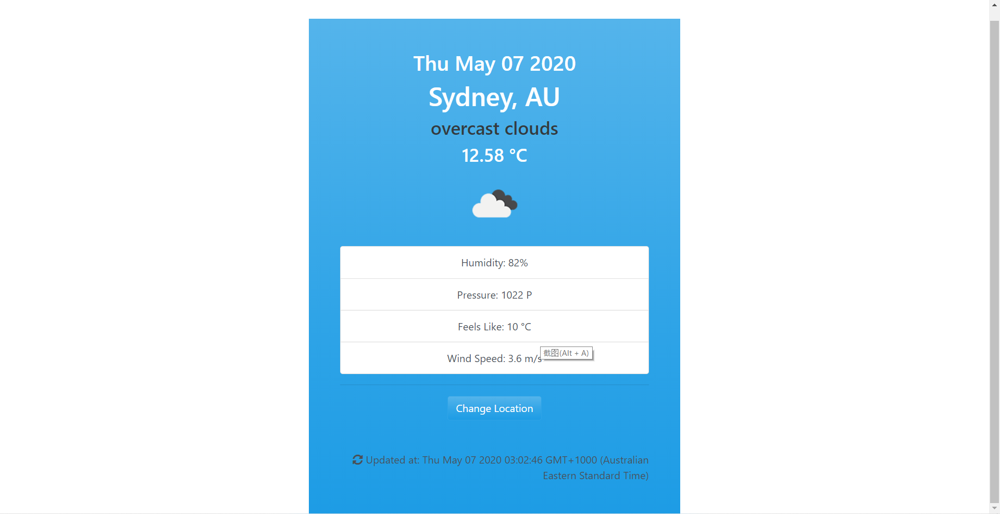

# weather_js
A weather web app using openweather api.
<ul>
<li>change location by entering city name and country's initial</li>
<li>user-friendly interface</li>
<li>includes detailed weather infotmation besides weather and temperature</li>
</ul>
 
 

